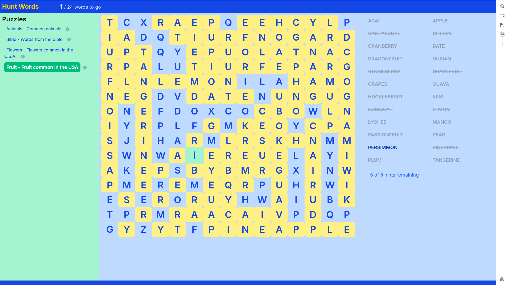

# huntwords

Hunt for words in a grid of letters



## Usage

Run `uvextras run up`. Upon startup the ui component will display the ports exposed.

```
ui_1               | --
ui_1               | -- ------------------------------------------------------------
ui_1               | -- SUMMARY
ui_1               | -- ------------------------------------------------------------
ui_1               | --
ui_1               | SCRIPT: /docker-entrypoint.d/99-metrics.sh
ui_1               | nginx version: nginx/1.29.6
ui_1               | NGINX:
ui_1               | ui: http://localhost:8090
```

Visit the following urls as mentioned in the output above.

| URL                                    | What            |
| -------------------------------------- | --------------- |
| [http://localhost:8090/](http://localhost:8090/) | Hunt Words UI   |

Click on one of the links of defined puzzles on the left and then click on a letter in the grid to *find* one of the words from the list on the right.

If nothing happens when you click on a letter, that is a sign that letter is used by more than one words (free hint).

Clicking on a word in the list will cause that word to be highlighted in the grid. But, only ask for a hint if you are really stuck. You only get 5 hints per game!

## Running

```bash
uvextras run up
```

In another shell:
```bash
uvextras run refresh
```

> [refresh_puzzleboards.sh](./etc/refresh_puzzleboards.sh) is designed to be able to be scheduled via cron.

When done using the app, simply run the following command to tear down and clean up.
```bash
uvextras run allclean
```


## Raspberry Pi
Huntwords is deployed onto a Raspberry Pi 4B using _docker compose_.
